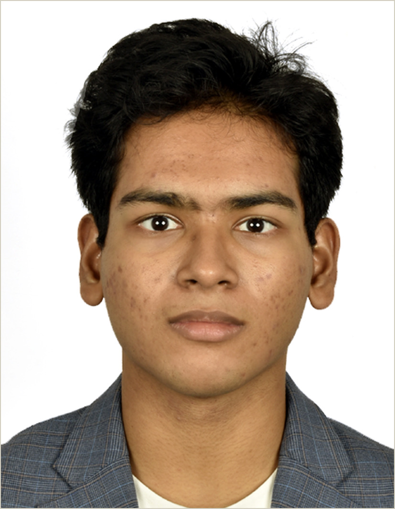
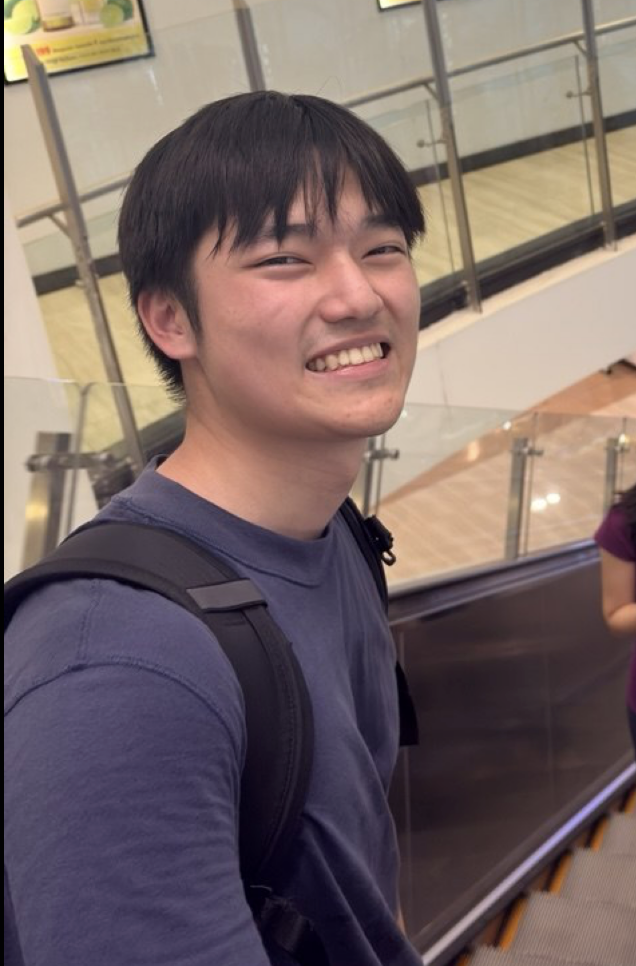

We are a team based in the [School of Computing, National University of Singapore](https://www.comp.nus.edu.sg).

You can reach us at the email `e1525605@u.nus.edu`

## Project team

### Yu Xi Lim

[[github](https://github.com/yxlyx)]

* Role: Developer
* Responsibilities: Filtering/search commands

### Zong Wei Quah

[[github](http://github.com/zwqqwz123)]

* Role: Developer
* Responsibilities: UI

### Satapathy Pulastya 

[[github](http://github.com/pulas2345)]

* Role: Developer
* Responsibilities: Data

### Eric Chan

[[github](http://github.com/riceric8)]

* Role: Developer
* Responsibilities: Dev Ops

### Tharun Balaji

[[github](https://github.com/codeforce233)]

* Role: Developer
* Responsibilities: Integration + Code Quality
