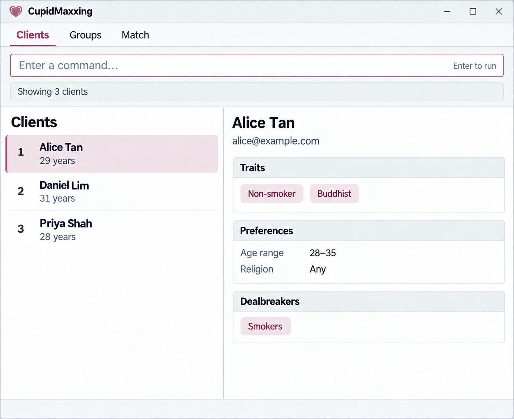

CupidMaxxing is a **desktop application for managing contacts, optimized for use through a Command Line Interface (CLI)** while retaining the benefits of a Graphical User Interface (GUI). CupidMaxxing helps independent matchmakers efficiently organize and retrieve client contact information, making it faster to identify relevant contacts and coordinate introductions between suitable clients.

* Table of Contents
{:toc}

--------------------------------------------------------------------------------------------------------------------

## Quick start

1. Ensure that Java `25` or later is installed on your computer. 
   **Mac users:** Ensure you have the precise JDK version prescribed [here](https://se-education.org/guides/tutorials/javaInstallationMac.html).

1. Download the latest `.jar` file from [here](https://github.com/se-edu/addressbook-level3/releases).

1. Copy the file to the folder you want to use as the _home folder_ for your AddressBook.

1. Open a terminal, `cd` to the folder containing the JAR file, and run `java -jar addressbook.jar`. 
   A GUI similar to the one below should appear in a few seconds. Note how the app contains some sample data. 
   

1. Type a command in the command box and press Enter to execute it. For example, type **`help`** and press Enter to open the help window. 
   Some example commands you can try:

   * `list` : Lists all contacts.

   * `add n/John Doe p/98765432 e/johnd@example.com a/John street, block 123, #01-01` : Adds a contact named `John Doe` to the Address Book.

   * `delete 3` : Deletes the 3rd contact shown in the current list.

   * `clear` : Deletes all contacts.

   * `exit` : Exits the app.

1. Refer to the [Features](#features) section below for details of each command.

--------------------------------------------------------------------------------------------------------------------

## Features

**:information_source: Notes about the command format:** 

* Words in `UPPER_CASE` are the parameters to be supplied by the user. 
  For example, in `add n/NAME`, replace `NAME` with a value such as `John Doe`.

* Items in square brackets are optional. 
  For example, `n/NAME [t/TAG]` can be used as `n/John Doe t/friend` or as `n/John Doe`.

* Items followed by `…`​ can appear zero or more times. 
  For example, `[t/TAG]…​` may be omitted, or written as `t/friend` or `t/friend t/family`.

* Parameters can be in any order. 
  For example, if the command specifies `n/NAME p/PHONE_NUMBER`, `p/PHONE_NUMBER n/NAME` is also acceptable.

* Extraneous parameters for commands that take no parameters, such as `help`, `list`, `exit`, and `clear`, are ignored. 
  For example, `help 123` is interpreted as `help`.

* If you are using a PDF version of this document, be careful when copying and pasting commands that span multiple lines as space characters surrounding line-breaks may be omitted when copied over to the application.

### Viewing help: `help`

Shows a message explaining how to access the help page.

Format: `help`

### Adding a client: `add`

Adds a client to CupidMaxxing. In addition to the usual contact fields, you can record the client's own attributes, partner preferences, and dealbreakers. All matchmaking fields are optional.

Format: `add n/NAME p/PHONE_NUMBER e/EMAIL a/ADDRESS [g/GENDER] [t/TAG]… [r/RELIGION] [s/SMOKING] [age/AGE] [pref/ATTRIBUTE:VALUE]… [db/ATTRIBUTE:VALUE]…`

* `g/GENDER` records the client's own gender: `m` (man), `w` (woman), or `nb` (non-binary). Values are case-insensitive and surrounding whitespace is ignored. Omit `g/` or leave it empty to record an unspecified gender. Only one value and one `g/` prefix are allowed per command.
* `r/RELIGION` is the client's religion. It contains letters and spaces only, and is 1-30 characters long after trimming.
* `s/SMOKING` is `yes` or `no` (case-insensitive).
* `age/AGE` is a whole number from 18 to 99.
* `pref/ATTRIBUTE:VALUE` records a preferred partner attribute; `db/ATTRIBUTE:VALUE` records an attribute that excludes a partner. `ATTRIBUTE` is `age`, `religion`, or `smoking` (case-insensitive). Use `age:MIN-MAX`, a valid religion value, or `yes`/`no` respectively.
* Each preference attribute and each dealbreaker attribute may appear once per command. Supplying an existing attribute later overwrites its stored value.

Examples:

* `add n/Sarah Tan p/91234567 e/sarah@example.com a/12 Clementi Rd g/w`
* `add n/Wei Ming p/98765432 e/wm@example.com a/5 Bedok Ave age/34 r/christian pref/age:28-36 db/smoking:yes`

### Listing all clients: `list`

Shows a list of all clients in CupidMaxxing.

Format: `list`

### Editing a client: `edit`

Edits the client at `INDEX` in the currently displayed list. `INDEX` must be a positive integer.

Format: `edit INDEX [n/NAME] [p/PHONE] [e/EMAIL] [a/ADDRESS] [g/GENDER] [t/TAG]… [r/RELIGION] [s/SMOKING] [age/AGE] [pref/ATTRIBUTE:VALUE]… [db/ATTRIBUTE:VALUE]…`

The matchmaking fields follow the same rules as [`add`](#adding-a-client-add). Existing values are overwritten. When editing tags, existing tags are replaced; use `t/` to clear all tags. For gender, use `g/m`, `g/w`, or `g/nb` to replace the value, use empty `g/` to clear it, or omit `g/` to keep the existing value. Gender can be edited together with other supported contact fields.

Examples:

* `edit 1 g/nb` changes the first displayed client's gender to non-binary.
* `edit 1 g/` clears that client's gender.
* `edit 1 r/christian s/no age/28`
* `edit 1 pref/age:25-35`
* `edit 2 age/34 pref/religion:hindu db/smoking:yes`

### Finding clients by attributes: `find`

Search by name or by the client's own gender. Each search examines the full client list and replaces the displayed results.

Formats:

* `find KEYWORD [MORE_KEYWORDS]…` retains name search: case-insensitive, whole-word matching, returning clients whose names contain any supplied keyword.
* `find g/GENDER[,GENDER]…` returns clients matching any listed gender. Valid values are `m`, `w`, and `nb`, in any order, ignoring case and surrounding whitespace.
* `find g/` returns every client with a specified gender, equivalent to `find g/m,w,nb`. Clients with an unspecified gender are excluded from gender searches.

Examples:

* `find Alex Sam` finds clients whose names contain Alex or Sam.
* `find g/w` finds women.
* `find g/m,nb` finds men or non-binary clients.

Use `g/` only once. Duplicate values (including `m,M`), unsupported values, and empty items such as `m,` or `m,,w` are rejected. Comma lists are supported only by `find`, not by `add` or `edit`. Commands and prefixes must be lowercase. Separate each prefix from preceding text with a space.

Name keywords cannot be combined with `g/`. Gender searches combined with age, smoking or religion are not supported in this increment. Invalid gender commands show an error and leave records and the displayed results unchanged.

#### Planned searches across other attributes

The following combined search is planned and is not implemented in this increment. It returns clients that satisfy at least one supplied criterion (OR logic).

Format: `find [age/MIN-MAX] [s/STATUS] [r/RELIGION]`

At least one criterion is required. A client whose relevant attribute is unknown does not satisfy that criterion, but can still be returned when it satisfies another one. Each search examines the full client list and replaces the current displayed results; criteria never accumulate.

Examples:

* `find age/25-35 r/buddhist` returns clients aged 25-35 or clients whose religion is Buddhist.
* `find s/no` returns non-smoking clients.

### Filtering clients by attributes: `filter`

Returns clients that satisfy every supplied criterion (AND logic).

Format: `filter [age/MIN-MAX] [s/STATUS] [r/RELIGION]`

At least one criterion is required. The parameter requirements are the same as for [`find`](#finding-clients-by-attributes-find), but a client with an unknown attribute is excluded.

Example: `filter age/25-35 s/no r/buddhist` returns only Buddhist, non-smoking clients aged 25-35.

For `find` and `filter`:

* `age/MIN-MAX` uses two whole numbers from 18 to 120, inclusive, with no spaces and `MIN` no greater than `MAX`. Use `age/30-30` for an exact age.
* `s/STATUS` is `yes` or `no`, case-insensitive.
* `r/RELIGION` is `buddhist`, `christian`, `hindu`, `muslim`, `sikh`, `taoist`, `other`, or `none`, case-insensitive. `other` does not mean that two clients share the same religion.
* Each parameter may be supplied once and in any order. Prefixes and command names must be lowercase.

### Checking compatibility: `match`

Compares two different clients from the currently displayed list. It does not change client data or the displayed list.

Format: `match INDEX_A INDEX_B`

Both indexes must be positive whole numbers in the current list. The result names both clients and shows each directional preference/dealbreaker comparison as **Met**, **Unmet**, or **Unknown**. Missing information is **Unknown**, while an unspecified preference or dealbreaker creates no restriction.

The overall result is determined in this order:

1. **Incompatible** - a dealbreaker is violated in either direction.
1. **Insufficient information** - no known dealbreaker is violated, but needed comparison data is missing.
1. **Potential match - preference differences** - dealbreakers pass but at least one preference is unmet.
1. **Potential match - all recorded criteria met** - all checks pass and at least one preference or dealbreaker exists.
1. **No criteria recorded** - neither client has preferences or dealbreakers.

Example: `match 2 5`

### Organising clients into groups: `group`

Creates and manages named client groups. Group names contain letters, numbers, and spaces only, and are 1-30 characters long after trimming. Names are case-insensitive for duplicate checking. A client may belong to many groups, but cannot appear twice in the same group.

Formats:

* `group create g/GROUP_NAME`
* `group rename g/GROUP_NAME ng/NEW_GROUP_NAME`
* `group delete g/GROUP_NAME`
* `group add g/GROUP_NAME INDEX [INDEX]…`
* `group remove g/GROUP_NAME INDEX [INDEX]…`
* `group show g/GROUP_NAME`
* `group list`

`INDEX` values must be different positive whole numbers in the currently displayed list. `group show` replaces the displayed list with that group's clients. Deleting a group does not delete its clients, and renaming one keeps its members. `group list` shows every group with its member count.

Examples:

* `group create g/VIP`
* `group add g/VIP 2 5`
* `group rename g/VIP ng/Priority Clients`
* `group show g/Priority Clients`

### Deleting a client: `delete`

Deletes the specified client from CupidMaxxing.

Format: `delete INDEX`

* Deletes the client at the specified `INDEX`.
* The index refers to the index number shown in the displayed client list.
* The index **must be a positive integer** 1, 2, 3, …​

Examples:
* `list` followed by `delete 2` deletes the 2nd client in CupidMaxxing.
* `filter s/no` followed by `delete 1` deletes the 1st client in the filtered results.

### Clearing all entries: `clear`

Clears all entries from the address book.

Format: `clear`

### Exiting the program: `exit`

Exits the program.

Format: `exit`

### Saving the data

AddressBook automatically saves data after every command. You do not need to save manually. Gender is saved with each client; older records without a gender load as unspecified.

### Editing the data file

AddressBook data is saved automatically as a JSON file `[JAR file location]/data/addressbook.json`. Advanced users are welcome to update data directly by editing that data file.

:exclamation: **Caution:**
If your changes make the data file invalid, AddressBook starts with an empty address book at the next run. The invalid file remains on disk until you run a command (AddressBook saves after every command). Still, we recommend backing up the file before editing it. 
Furthermore, certain edits can cause the AddressBook to behave in unexpected ways (e.g., if a value entered is outside of the acceptable range). Therefore, edit the data file only if you are confident that you can update it correctly.

### Archiving data files `[coming in v2.0]`

_Details coming soon ..._

--------------------------------------------------------------------------------------------------------------------

## FAQ

**Q**: How do I transfer my data to another computer? 
**A**: Install the app on the other computer and overwrite the data file it creates with the data file from your previous AddressBook home folder.

--------------------------------------------------------------------------------------------------------------------

## Known issues

1. **When using multiple screens**, if you move the application to a secondary screen, and later switch to using only the primary screen, the GUI will open off-screen. The remedy is to delete the `preferences.json` file created by the application before running the application again.
2. **If you minimize the Help Window** and then run the `help` command (or use the `Help` menu, or the keyboard shortcut `F1`) again, the original Help Window will remain minimized, and no new Help Window will appear. The remedy is to manually restore the minimized Help Window.

--------------------------------------------------------------------------------------------------------------------

## Command summary

Action | Format, Examples
--------|------------------
**Add client** | `add n/NAME p/PHONE_NUMBER e/EMAIL a/ADDRESS [g/GENDER] [t/TAG]… [r/RELIGION] [s/SMOKING] [age/AGE] [pref/ATTRIBUTE:VALUE]… [db/ATTRIBUTE:VALUE]…` e.g., `add n/Wei Ming p/98765432 e/wm@example.com a/5 Bedok Ave age/34 r/christian pref/age:28-36 db/smoking:yes`
**Clear** | `clear`
**Delete client** | `delete INDEX` e.g., `delete 3`
**Edit client** | `edit INDEX [n/NAME] [p/PHONE_NUMBER] [e/EMAIL] [a/ADDRESS] [g/GENDER] [t/TAG]… [r/RELIGION] [s/SMOKING] [age/AGE] [pref/ATTRIBUTE:VALUE]… [db/ATTRIBUTE:VALUE]…` e.g., `edit 2 age/34 pref/religion:hindu db/smoking:yes`
**Find clients** | `find KEYWORD [MORE_KEYWORDS]…` or `find g/GENDER[,GENDER]…` or `find g/` e.g., `find g/m,nb`
**Find clients by other attributes (planned, OR)** | `find [age/MIN-MAX] [s/STATUS] [r/RELIGION]` e.g., `find age/25-35 r/buddhist`
**Filter clients (AND)** | `filter [age/MIN-MAX] [s/STATUS] [r/RELIGION]` e.g., `filter age/25-35 s/no r/buddhist`
**Match clients** | `match INDEX_A INDEX_B` e.g., `match 2 5`
**Create group** | `group create g/GROUP_NAME` e.g., `group create g/VIP`
**Rename group** | `group rename g/GROUP_NAME ng/NEW_GROUP_NAME` e.g., `group rename g/VIP ng/Priority Clients`
**Delete group** | `group delete g/GROUP_NAME` e.g., `group delete g/Priority Clients`
**Add clients to group** | `group add g/GROUP_NAME INDEX [INDEX]…` e.g., `group add g/VIP 2 5`
**Remove clients from group** | `group remove g/GROUP_NAME INDEX [INDEX]…` e.g., `group remove g/VIP 2`
**Show group** | `group show g/GROUP_NAME` e.g., `group show g/VIP`
**List groups** | `group list`
**List clients** | `list`
**Help** | `help`
**Exit** | `exit`
